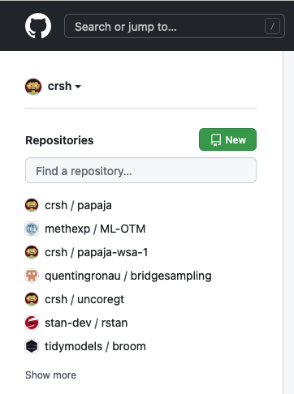
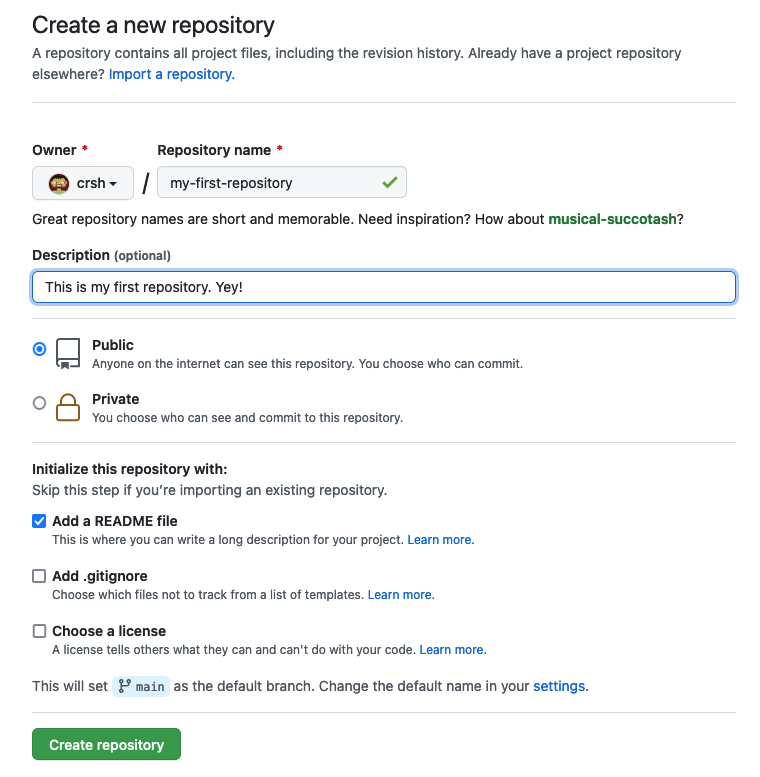
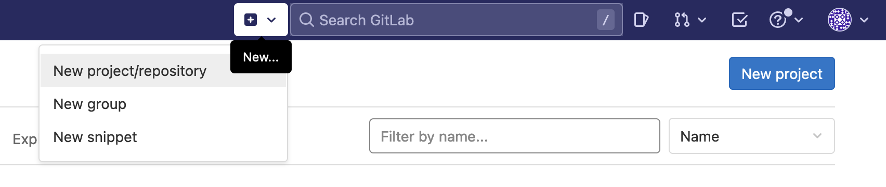
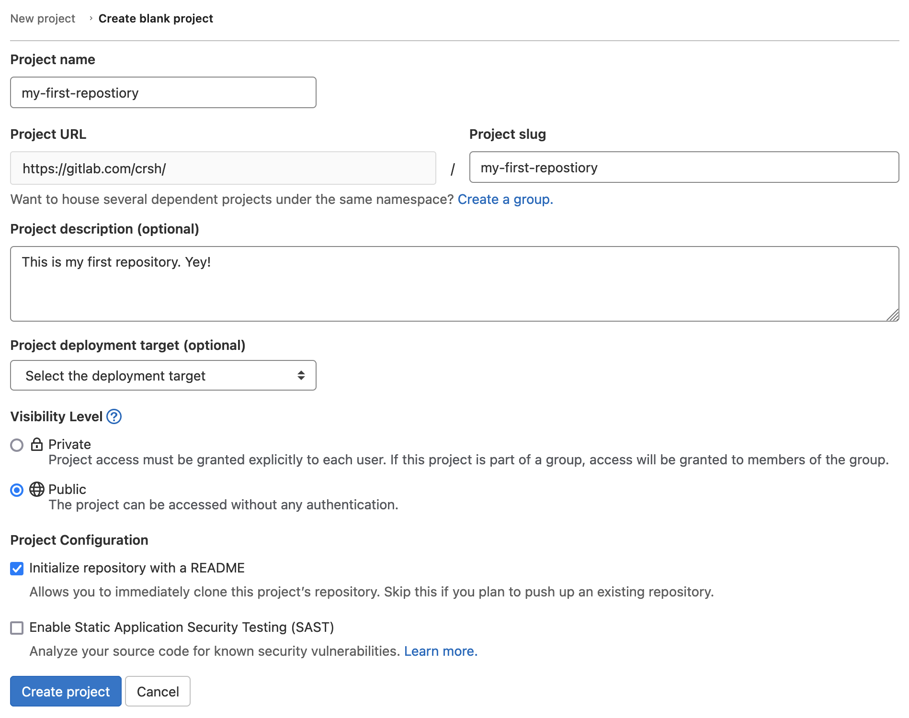

```{r child = "_setup.Rmd"}
```


```{block, box.title = "Exercise 1", box.body = list(fill = "white"), box.icon = "fa-star"}
Go to GitHub (or GitLab) and create a new repository for this workshop.
```

```{block, box.title = "Solution 1", box.icon = "fa-check", solution = TRUE}
### GitHub





---

### GitLab




```
