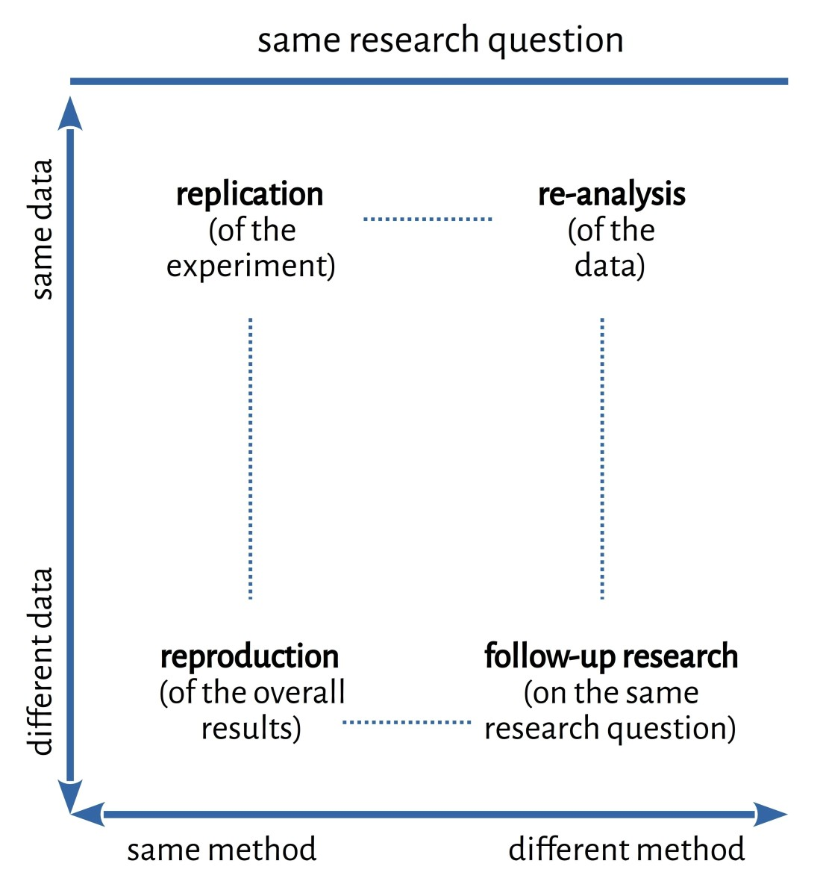

exclude: true


```{r child = "_setup.Rmd"}

```

---

# About us

[Frederik Aust](http://frederikaust.com/) ([f.aust@uva.nl](mailto:f.aust@uva.nl), [@frederikaust](http://twitter.com/frederikaust))

- PostDoc with Prof. Dr. Eric-Jan Wagenmakers at the University of Amsterdam

--
    - Mathematical models of learning and memory
    - Bayesian statistics
    - Computational reproducibility
--
- Author and contributor to several R packages<br> (e.g., [`afex`](https://cran.r-project.org/web/packages/afex/index.html), [`citr`](https://cran.r-project.org/web/packages/citr/index.html), [`papaja`](https://github.com/crsh/papaja))

---

<!-- Johannes takes over from here -->

# About us

[Johannes Breuer](https://www.johannesbreuer.com/) ([johannes.breuer@gesis.org](mailto:johannes.breuer@gesis.org), [@MattEagle09](https://twitter.com/MattEagle09)

- Senior researcher at [*GESIS - Leibniz Institute for the Social Sciences*](https://www.gesis.org/home) (Department Survey Data Curation) & (co-) leader of the team *Research Data & Methods* at the [*Center for Advanced Internet Studies*](https://www.cais.nrw/) (CAIS)

--

  - Uses and effects of digital media
  - Computational methods
  - Data management & Open science

---

# About you

- What's your name?  

- What is your research area?  

- What are your experiences with reproducible research (and the tools we cover in this course)?

- What are your expectations for this course?

---

# Preliminaries

Slides and material are available at

.center[https://github.com/crsh/reproducible-research-practices-workshop]

- The workshop consists of a combination of lectures and hands-on exercises

- Feel free to ask questions anytime

- We will have frequent breaks (please remind us if necessary)

---

# Preliminaries

Did you have any trouble with the setup for this workshop?

Installing...

- [`git`](https://git-scm.com/)
- [`R`](https://www.r-project.org/) & [*RStudio*](https://www.rstudio.com/products/rstudio/)
- a `TeX` distribution (e.g., [TinyTeX](https://yihui.name/tinytex/))
- [`papaja`](https://github.com/crsh/papaja)

---

# Preliminaries

Did you have any trouble with the setup for this workshop?

Creating...

- a [*GitHub*](https://github.com/) account
- an account for the [KU Leuven *GitLab*](https://gitlab.kuleuven.be/)
- access credentials for *GitHub* (HTTPS, PAT) and *GitLab* (SSH)

---

## Course schedule

.center[**Wednesday, April 27th, 2022**]
```{r schedule Wed, echo = F}
schedule <- data.frame(
  "When?" = c("10:00 - 12:00", "12:00 - 13:00", "13:00 - 15:00", "15:00 - 15:30", "15:30 - 17:30")
  , "What?" = c("Introduction: Reproducible Workflows", "<i>Lunch break</i>", "Introduction to R Markdown", "<i>Coffee break</i>", "papaja")
  , check.names = FALSE
)
knitr::kable(
  schedule
  , format = "html"
  , align = "cc"
  , escape = FALSE
)
```

---

## Course schedule

.center[**Thursday, April 28th, 2022**]
```{r schedule Thur-1, echo = F}
sharing_options <- data.frame(
  "When?" = c("09:00 - 10:15", "10:15 - 10:30", "10:30 - 11:30", "11:30 - 12:30")
  , "What?" = c("Introduction to Git & GitHub", "<i>Coffee break</i>", "Git in RStudio", "Git & GitHub for collaboration - Part 1")
  , check.names = FALSE
)
knitr::kable(
  sharing_options
  , format = "html"
  , align = "cc"
  , escape = FALSE
)
```

---

## Course schedule

.center[**Thursday, April 28th, 2022**]
```{r schedule Thur-2, echo = F}
sharing_options <- data.frame(
  "When?" = c("12:30 - 13:30", "13:30 - 14:00", "14:00 - 14:15", "14:15 - 15:30", "15:30 - 16:00")
  , "What?" = c("<i>Lunch break</i>", "Git & GitHub for collaboration - Part 2", "<i>Coffee break</i>", "Other tools & workflows for reproducible research", "Wrap-Up")
  , check.names = FALSE
)
knitr::kable(
  sharing_options
  , format = "html"
  , align = "cc"
  , escape = FALSE
)
```

---

# What is reproducibility?

class: center, middle

```{r repro-tweet, echo=FALSE}
tweetrmd::tweet_embed("https://twitter.com/jakevdp/status/519563939177197571")
```

---

# Why reproducibility matters

class: center, middle

```{r repro-lazy, echo=FALSE}
tweetrmd::tweet_embed("https://twitter.com/hadleywickham/status/598532170160873472")
```

---

# Defining reproducibility

As with (almost) everything in science, there are different definitions of reproducibility.
We will discuss some of them in the following.

---

# Defining dimensions

3-dimensional concept space

```{r, three-dims, out.width = "50%", echo = F}
include_graphics("./img/trr-cube.jpg")
```
<small><small>By Christof Schöch. Source: https://dh-trier.github.io/trr/#/2/1</small></small>

---

# Defining dimensions

```{r, turing-dims, out.width = "75%", echo = F}
include_graphics("./img/turing_way_parts.jpg")
```
<small><small>[*The Turing Way Project*](https://the-turing-way.netlify.app/welcome.html) illustration by Scriberia. DOI: [10.5281/zenodo.3332807](https://doi.org/10.5281/zenodo.3332807)</small></small>

---

# *The Turing Way* definition

```{r, turing-def, out.width = "80%", echo = F}
include_graphics("./img/reproducible-matrix.jpg")
```
<small><small>Source: https://the-turing-way.netlify.app/reproducible-research/overview/overview-definitions.html</small></small>

---

# Replication or reproduction?

```{r, other-def, out.width = "50%", echo = F}

```
<small><small>By Christof Schöch. Source: https://dh-trier.github.io/trr/#/2/2</small></small>

---

<!-- Frederik takes over from here -->

# Zooming in (on experimental research)

Add figure from papaja workshop advanced slide 19 here (Frederik to continue with a focus on computational reproducibility)

---

# Reproducible research workflows

> being an open scientist means .highlight[adopting a few straightforward research management practices, which lead to less error-prone, reproducible research workflows] ([Klein et al., 2018](https://doi.org/10.1525/collabra.158), p. 11)

---

# Research management practices

There are quite a few practices that researchers can adopt to increase the reproducibility of their work.

- Project-oriented workflow (for `R`, see, e.g., https://www.tidyverse.org/blog/2017/12/workflow-vs-script/)
- Folder structures (see https://psych-transparency-guide.uni-koeln.de/folder-structure.html)
- Naming things (https://betterprogramming.pub/string-case-styles-camel-pascal-snake-and-kebab-case-981407998841?gi=3295916e039)
- ...

<!-- also mention/discuss file paths here? relative vs. absolute -->

---

# Exercise: Folder structures

If you feel comfortable with that, feel free to share screenshots of some of your project folders. You can choose examples that you think are particularly well-organized as well as negative examples from your "dark past" as someone whose research might have been difficult to reproduce.

---

<!-- Johannes takes over from here -->

# Sharing is caring

.small[
One prerequisite for research being reproducible (by others) is sharing research materials. There are many parts of their work that researchers can share to increase the reproducibility as well as the (potential) replicability of their work (see Klein et al., 2018). Four main types of output are:

1. Data
2. Code & scripts (for data collection, processing, and analysis)
3. Other study materials (e.g., questionnaires or stimulus materials)
4. (Detailed) Information about the study procedure

Notably, all of these outputs should be well-documented (e.g., via ReadMe files, metadata or comments in code).
]

---

# Sharing for reproducibility

While sharing study materials and information about the procedure are important for replicability, for reproducibility, the most important things to share are the data and code.

---

# Sharing data & code

There are many different ways in which researchers can share their data and code/scripts (see Klein et al., 2018). Keeping only local copies of things and sharing upon personal request is not a very sustainable or scalable solution. The better option is sharing via institutional or public archives and repositories.

---

# Fantastic repositories and where to find them `r ji("dragon")`

The paper by [Klein et al. (2018)](https://doi.org/10.1525/collabra.158) provides an overview of public repositories that hold psychological data.<sup>1</sup>
A good tool for finding suitable repositories is the [*Registry of Research Data Repositories*](https://www.re3data.org/).

<small><small>[1] However, parts of this overview have become somewhat outdated since the paper was published.</small></small>


---

# How to choose a repository

In general, research data (and code) that are publicly archived should follow the so-called [FAIR principles](https://www.go-fair.org/fair-principles/) ([Wilkinson et al., 2016](https://doi.org/10.1038/sdata.2016.18)), meaning that the shared materials should be...

- **F**indable: Persistent identifiers; metadata; indexed
- **A**ccessible: Retrievable by identifier; controlled access where necessary
- **I**nteroperable: Standardized metadata; open, lightweight, and interoperable file formats (e.g., CSV, TSV, JSON, ODS)
- **R**eusable: Documented; clear usage license

---

# How to choose a repository

Some more specific key criteria for choosing a repository are that it should...

- use persistent and unique identifiers (such as DOIs)
- accommodates licensing
- features access controls (e.g., allowing the restriction of 
access to a particular set of users)
- have persistence guarantees for long-term access
- store data in accordance with local legislation (e.g. the [GDPR](https://gdpr.eu/) in Europe)

.small[See [Klein et al., (2018)](https://doi.org/10.1525/collabra.158) for further details
]

---

# Public archiving options

Two archiving options that are quite popular among researchers (esp. also in psychology) are the [*Open Science Framework*](https://osf.io/) (OSF) and [*Zenodo*](https://zenodo.org/). While these two archives are not curated, which somewhat reduces findability, they are quite flexible and easy to use. They can be used to share different types of content, including data and code/scripts, and also offer some degree of access control. A nice feature of the *OSF* and *Zenodo*, especially for sharing code, is that they both offer integration with *GitHub* (which facilitates version control).

---

# Tools & tool stacks

As you probably already know, there are lots of different tools and workflows that can be used to increase the reproducibility of research. These tools can then be combined into different tool stacks. We will introduce you to some of those in this workshop, but there are many more, and, in the end, it depends on your personal preferences and needs what tools/tool stacks and workflows you (should) employ.<sup>1</sup>

<small><small>[1] As you will see, the two of us also have different preferences in our workflows and tool use.</small></small>

---

# Tools in this workshop

As stated before, we will focus on the following tools for reproducible research in this workshop:

- `Git` & *GitHub*/*GitLab*
- `R Markdown`

We will focus on using them via *RStudio*.

.small[
*Note*: In the outlook part, we will also briefly introduce some other/additional tools.
]
