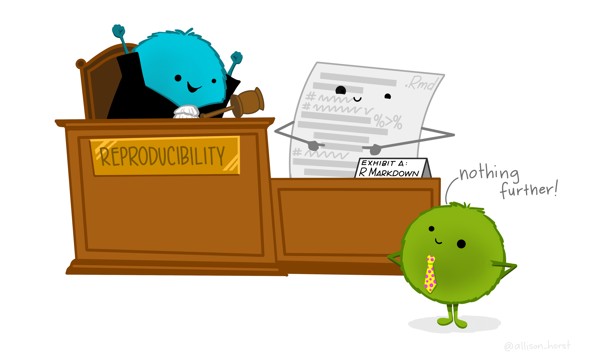
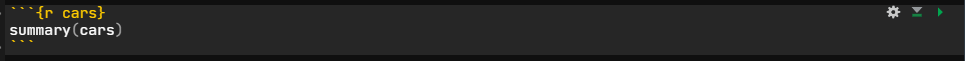
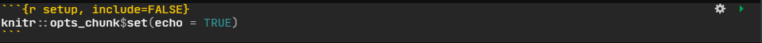
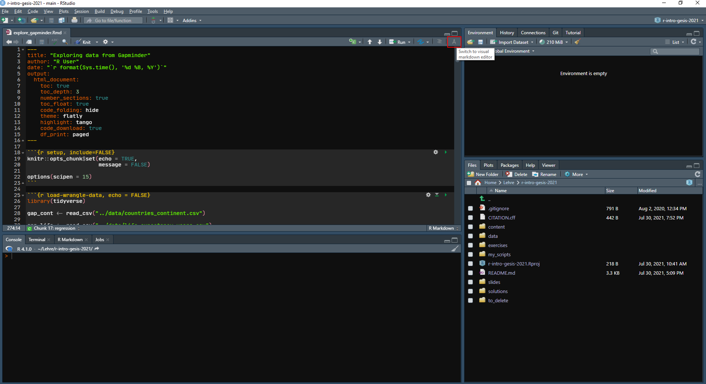
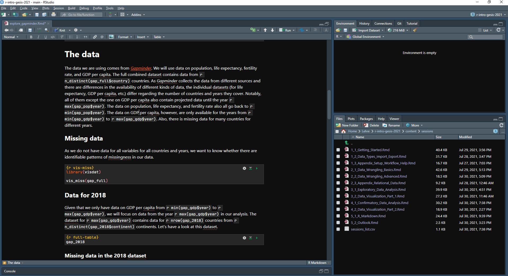

exclude: true

```{r setup, include = FALSE}
library(knitr)
options(htmltools.dir.version = FALSE)
opts_chunk$set(echo = FALSE, fig.align = "center")

# remotes::install_github("gadenbuie/xaringanExtra")
library(xaringanExtra)
library(xaringanthemer)
library(emo)

my_colors <- c("#bc0031", "#d67f42")
```

```{r extras-styling, include = FALSE}
use_xaringan_extra(c("tile_view", "clipboard"))

style_mono_accent(
  base_color = my_colors[1]
  , header_font_google = google_font("Poppins")
  , header_h1_font_size = "36pt"
  , text_font_google = google_font("Open Sans")
  , text_font_size = "22pt"
  , text_color = "#3a3a3a"
  , outfile = "src/xaringan-themer.css"
)
```

```{r}
add_overlay <- function(..., label = NULL, label_style = NULL) {
  el <- list(...)
  
  y <- '<div id="overlay-highlight"'
  if(length(el) > 0) {
    y <- c(y, 'style="', glue::glue('{names(el)}:{el};'))
  }
  y <- c(y, '">')
  
  if(!is.null(label)) {
    y <- c(y, glue::glue('<span" class="vertical-center"" style="{label_style}">{label}</span>'))
  }
  
  knitr::asis_output(glue::glue_collapse(c(y, "</div>")))
}
```

---

# Dynamic documents

Dynamic documents are derived from the concept of [literate programming](https://en.wikipedia.org/wiki/Literate_programming). They fuse computer code and documentation and results are embedded directly into the document.

---

# Dynamic documents

Dynamic documents can be a partial solution to the challenge of computational reproducibility (same data, same code, same results). They can prevent transcription errors and ensure that statistics, tables, and figures represent the current analytic approach.

--

One solution for producing dynamic documents is `R Markdown`.

---

# What is `R Markdown`?

>R Markdown provides an unified authoring framework for data science, .highlight[combining your code, its results, and your prose commentary]. R Markdown documents are .highlight[fully reproducible] and .highlight[support dozens of output formats], like PDFs, Word files, slideshows, and more ([R for Data Science](https://r4ds.had.co.nz/r-markdown.html)).

--

`R Markdown` is...

- an authoring framework

--

- a document format (`.Rmd`)

--

- an [`R` package](https://github.com/rstudio/rmarkdown)

---

# What is `R Markdown`?

## [Markdown](https://en.wikipedia.org/wiki/Markdown) + `R`

TL;DR of the *Wikipedia* article: `Markdown` is a lightweight markup language for text formatting.

---

# What does `R Markdown` do?

```{r, rmarkdown-rocks-cartoon, out.width = "75%", echo = F}
include_graphics("./img/rmarkdown_rockstar.png")
```
.footnote[
[Artwork]((https://github.com/allisonhorst/stats-Artworks)) by [@allison_horst](https://twitter.com/allison_horst)
]

---

# `R Markdown` and reproducibility

As it combines code, text, and outputs, `R Markdown` is a great tool for writing reproducible publications (papers, project reports, etc.).

```{r, rmarkdown-repro-cartoon, out.width = "70%", echo = F}

```
.footnote[
[Artwork]((https://github.com/allisonhorst/stats-Artworks)) by [@allison_horst](https://twitter.com/allison_horst)
]

---

# What can you do with `R Markdown`?

In a nutshell, with `R Markdown` it is possible to generate **reproducible** dynamic documents which...

- (can) include text, code, and output from that code

--

- render to many different output formats, including:
  + `HTML`
  + `Markdown`
  + `PDF`
  + *Microsoft Word*
  + Open Document
  + `RTF`

For a [full list of supported output formats](https://rmarkdown.rstudio.com/docs/reference/index.html#section-output-formats) see the `rmarkdown` package documentation.

---

# What can you do with `R Markdown`?

There are quite a few packages that offer extension output formats for `R Markdown`. For example:

- [`xaringan`](https://github.com/yihui/xaringan) for presentations - which is what we use for our slides
- [`bookdown`](https://bookdown.org/) for books (but also for websites)
- [`blogdown`](https://bookdown.org/yihui/blogdown/) for websites
- [`vitae`](https://github.com/mitchelloharawild/vitae) for (data-based) Résumés and CVs
- [`posterdown`](https://github.com/brentthorne/posterdown) for academic (conference) posters
- [`flexdashboard`](https://rmarkdown.rstudio.com/flexdashboard/index.html) for interactive dashboards

... and there are many more.

---

# `R Markdown` and versatility

```{r rmd-formats, echo=FALSE}
include_graphics("./img/rmarkdown_formats.png")
```

---

# Disclaimer: What we will cover

Covering everything you can do with `R Markdown` or even exploring all options for specific kinds of outputs, such as presentations or scientific publications, in-depth would be enough for separate workshops. Hence, this session will only cover the basics of `R Markdown`.

In the next session, we will discuss reference management with `R Markdown` and dive into the possibilities offered by the package [`papaja`](https://github.com/crsh/papaja) which can be used to prepare APA Journal Articles with `R Markdown`.

---

# Getting started with `R Markdown`

If you use *RStudio* you only need to install the `R Markdown` package:

```{r rmarkdown-requirements, eval = F}
install.packages("rmarkdown")
```

*Note*: If you do not have *RStudio* installed, you also need to [install Pandoc](https://pandoc.org/installing.html).

---

# PDF output with `R Markdown`

If you want to generate PDF output with `R Markdown`, you need $\LaTeX$. If you have a $\LaTeX$ distribution like [`MiKTeX`](https://miktex.org/) or [`TeX Live`](https://www.tug.org/texlive/) on your system, you should be all set.

If you do not have $\LaTeX$ installed, the easiest option - especially if you do not want to use plain $\LaTeX$ - is installing [`TinyTeX`](https://yihui.org/tinytex/), which is "a lightweight, cross-platform, portable, and easy-to-maintain LaTeX distribution based on TeX Live". You can do that using the [`tinytex` package](https://cran.r-project.org/web/packages/tinytex/index.html). It also takes care of installing missing $\LaTeX$ packages on the fly when knitting documents.

```{r tinytex, eval = F}
install.packages('tinytex')

tinytex::install_tinytex()
```

*Note*: You can also install $\LaTeX$ packages manually using the `tlmgr_install()` function from the `tinytex` package.

---

# Getting started with `R Markdown`

You can create a new `R Markdown` document in *RStudio* via *File* -> *New File* -> *R Markdown* in the menu. This will open a new window in which you can set the author and title and pick an output format for your document.

```{r, rmarkdown-menu, out.width = "50%", echo = F}
include_graphics("./img/create_rmarkdown_menu.png")
```

---

# Ingredients `r ji("stew")`

`R Markdown` documents are two-part plain text documents

1. YAML front matter
    - Document metadata
    - Rendering options
    
2. Document body
    - `Markdown` text
    - `R` code

---

# Anatomy of an `R Markdown` document

```{r, rmarkdown-annotated, out.width = "65%", echo = F}
include_graphics("./img/rmarkdown_example_annotated.png")
```

---

# YAML header

```{r yaml-101, eval = F}
---
title: "My First R Markdown Document"
subtitle: "A first in the series of many more to come"
author: "Gordon Shamway"
date: "28-04-2022"
output: html_document
---
```

[YAML](https://yaml.org/) stands for "YAML Ain't Markup Language" (formerly known as "Yet Another Markup Language"). The YAML header in `R Markdown` documents contains metadata for the document. It provides human-readable configuration information and can include a large variety of key:values-pairs to specify what the document should look like. It needs to be at the beginning of the document and start and end with `---`.

*Note*: There is an `R` package called [`ymlthis`](https://ymlthis.r-lib.org/) for creating extended YAML headers in and with `R`.

---

# YAML header


`YAML` data structures translate to (named) `list` objects in `R`

.pull-left-45[
```{yaml, echo = TRUE}
*---
title: "My First R Markdown Document"
author: "Gordon Shamway"
date: "28 04 2022"
output: html_document
*---
```
]

.pull-right-45[
```{r yaml-list}
str(
  list(
    title = "My First R Markdown Document"
    , author = "Gordon Shamway"
    , date = "28 04 2022"
    , output = "html_document"
  )
)
```
]

---

# YAML header

Indentations denote the nesting structure of a `list`

.pull-left-45[

```yaml
output:
  html_document:
    toc: yes
```

]

.pull-right-45[

```{r echo = FALSE}
str(
  list(
    output = list(
      html_document = list(
        toc = TRUE
      )
    )
  )
)
```

]

<br /><br /><br /><br />

--

`toc` is nested in `html_document` (i.e., it is an argument to that output function)

---

# YAML header

Similarly, it is possible to specify vectors.

```yaml
bibliography: ["references.bib", "r-pkg-references.bib"]
```

```{r echo = FALSE}
str(
  list(bibliography = c("references.bib", "r-pkg-references.bib"))
)
```

*Note*: We will cover how to manage references in `R Markdown` in the next session.

---

# YAML header

Text that spans multiple lines can be declared with `|`

```yaml
abstract: |
  This text spanns multiple rows.
  
  New lines are preserved, but note the indentation!
```

---

# YAML header

You can also use the `YAML` front matter to customize the appearance of the resulting documents. For example, you can specify that you want a table of contents (TOC), how many levels that should have, or whether sections should be numbered.

```{r yaml-custom, eval = F}
---
title: "My life with Chiroptophobia"
subtitle: "How fear can make us strong"
author: "Bruce Wayne"
date: "28-04-2022"
output: html_document:
    toc: true
    toc_depth: 2
    number_sections: true
---
```

---

# YAML header & $\LaTeX$

If you want to use `R Markdown` to generate PDF output via $\LaTeX$, you can make use of additional options in the `YAML` header, e.g., for loading additional $\LaTeX$ packages or specifying a different $\LaTeX$ engine (by default `pdflatex` is used) or keeping the `.tex` file.

```{r yaml-latex, eval=FALSE}
---
title: "Monkey Business"
subtitle: "My path to becoming a mighty pirate"
author: "Guybrush Threepwood"
date: "`r Sys.Date()`"
header-includes:
  - \usepackage{csquotes}
output:
  pdf_document:
    latex_engine: lualatex
    keep_tex: true
---
```

---

# `(R) Markdown` text formatting

While it is not necessary to know `Markdown` to use `R Markdown` (though if you want to know more, you can, e.g., check out the [Markdown Guide](https://www.markdownguide.org/) or this [interactive tutorial](https://commonmark.org/help/tutorial/)), it helps to know some of the basics of `Markdown` text formatting as they are the same for `R Markdown`.

---

# Text formatting

.pull-left[
### Syntax

```
***bold**

**italics*

****bold & italics***

~~strikethrough~~
```
]

.pull-right[
### Output

**bold**

*italics*

***bold & italics***

~~strikethrough~~
]

---

# Headers

.pull-left[
### Syntax

```
# Header 1

## Header 2

### Header 3
```
]

.pull-right[
### Output

# Header 1

## Header 2

### Header 3
]

---

# Paragraphs

A new paragraph is started with a blank line before the text. 

**NB**: If you just hit Enter/Return to move text to a new line in an `R Markdown` document, the text you enter after that will not be on a new line in the output document.

*Note*: When you generate `HTML` output, you can also use `HTML` commands in your `R Markdown` document. So, for example, you could insert an empty line with `<br>`. Likewise, when producing PDF output, you can use $\LaTeX$ commands, such as `\newline` or `\newpage`.

---

# Lists

.pull-left[
### Syntax

```
- unordered list
  + sub-item

1. ordered list
2. ordered list
  + sub-item
  + sub-item
```
]

.pull-right[
### Output

- unordered list
  - sub-item

1. ordered list
2. ordered list
  + sub-item
  + sub-item
]

---

## Other formatting stuff

.pull-left[
### Syntax

```
`library(tidyverse)`

[link](https://www.gesis.org)

> block quote

 
```
]

.pull-right[
### Output

`library(tidyverse)`

[link](https://www.gesis.org)

> block quote

```{r Rlogo, out.width = "20%", echo = FALSE}
include_graphics("./img/RLogo.png")
```
]


For more formatting options check out the [RMarkdown Reference Guide](https://rstudio.com/wp-content/uploads/2015/03/rmarkdown-reference.pdf) which is also available in *RStudio* via *Help* -> *Cheatsheets* -> *R Markdown Reference Guide*.

---

# Code chunks

```{r code-chunk, echo = F}

```

As the name says, code chunks in `R Markdown` documents include code. This is typically `R` code, but other languages are supported as well (e.g., `Python` or `SQL`). The code is executed when the file is knitted (we'll talk about what this means in a bit). 

You can insert a code chunk via the `Insert` button (select `R`) or using the keyboard shortcut <kbd>Ctrl + Alt + I</kbd> (*Windows* & *Linux*)/<kbd>Cmd + Option + I</kbd> (*Mac*). 

*Note*: It is possible to [render an `R` script into an `R Markdown` report](https://bookdown.org/yihui/rmarkdown-cookbook/spin.html) using `knitr::spin` and, vice versa, to [convert an `R Markdown` document to an `R` script](https://bookdown.org/yihui/rmarkdown-cookbook/purl.html) via `knitr::purl()`.

---

# Code chunks

It is good practice to name code chunks. In the example on the previous slide `{r cars}` specifies the language for the code `r` and a name `cars`. By naming code chunks it is, e.g., possible to reference them in other code chunks and they will also appear in the interactive ToC at the bottom of the tab for the `R Markdown` document. Chunk names may never be used twice in a single document and should not include spaces or underscores.

---

# Chunk options

```{r chunk-options, echo = F}
include_graphics("./img/code_chunk_options.png")
```

You can also set a variety of options for code chunks. In the above example, we set `echo = FALSE` which means that the code itself will not be displayed in the output document (only its output). Other exemplary chunk options are `eval = FALSE`, meaning that the code is not executed, or `warning = FALSE` or `message = FALSE` which mean that warnings or messages produced by the code are not shown in the output document. Yihui Xie, the main author of the `knitr` package, keeps an [updated list of all code chunk options](https://yihui.org/knitr/options/). 

---

# Setup chunk

```{r setup-chunk, echo = F}

```

It generally makes sense to include a setup chunk in your document (right after the YAML header). Here you can set global options for your code chunks (which can be overridden by setting options for individual chunks), general options for `R`, or already load packages.

---

# Inline code

```{r inline-code, echo = F}
include_graphics("./img/inline_code.png")
```

It is also possible to execute code within text. That way, the output is automatically updated if it is compiled again after the input (usually the data) has changed. Inline code needs to be enclosed in `backticks` and has to start with a specification of the language (typically `r`) if the code should be executed when the document is compiled. Only the result(s) of the inline code (not the code itself) will be displayed in the output document.

---

# Comments

It is also possible to include comments in an `R Markdown` document that will not be displayed in the output. 

To comment something out, you can select it and use the keyboard shortcut <kbd>Ctrl + Shift + C</kbd> (*Windows* & *Linux*)/<kbd>Cmd + Shift + C</kbd> (*Mac*). 

A comment in `R Markdown` looks like this: `<!-- This is a comment -->` 

---

# Knitting `r ji("yarn")`

To compile the `R Markdown` document (in this case into a `HTML`) document, you simply need to click the `Knit` `r ji("yarn")` button. Doing this will generate the `HTML` file (by default) in the directory where the `.Rmd` file is stored. It will also open a preview window in *RStudio*.

```{r, rmarkdown-preview, out.width = "55%", echo = F}

```

---

Knitting an `R Markdown` file

1. Starts a new `R` session
    - No variables defined
    - No `R` packages loaded
--

2. Sets the working directory to the location of the `R Markdown` file
3. Executes all `R` code chunks from top to bottom
    - Variables are available in subsequent chunks
    
*Note*: For computationally intensive tasks, you can set the option `opts_chunk$set(cache = TRUE)`. It will cache chunk calls and their results as long as you do not edit them.

---

# How `R Markdown` works

```{r, rmarkdown-wizards-cartoon, out.width = "85%", echo = F}
include_graphics("./img/rmarkdown_wizards.png")
```
.footnote[
[Artwork]((https://github.com/allisonhorst/stats-Artworks)) by [@allison_horst](https://twitter.com/allison_horst)
]

---

# How `R Markdown` works

Behind the scenes, `R Markdown` uses [`knitr`](https://yihui.org/knitr/) to execute the code and create a `Markdown` (`.md`) document with the code and output included, and [`pandoc`](https://pandoc.org/) to convert to a range of different output formats.

```{r, rmarkdown-process, out.width = "70%", echo = F}

```
.footnote[
Figure by [Andrew Collier](https://github.com/datawookie)
]

---

# Visual `R Markdown` editor

If [WYSIWYG](https://en.wikipedia.org/wiki/WYSIWYG) is more your thing, you can rejoice as new(er) versions of *RStudio* (v. 1.4 or higher) now offer a [Visual `R Markdown`](https://rstudio.github.io/visual-markdown-editing/#/) editor. If you have an `.Rmd` document open in *RStudio*, you can open the visual editor via the GUI (in the `Source` pane).

```{r, visual-rmd-open, out.width = "85%", echo = F}

```

---

# Visual `R Markdown` editor

You can use the visual editor in *RStudio* for editing your `R Markdown` document similar to *Microsoft Word*.

```{r, visual-rmd, out.width = "95%", echo = F}

```

---

# Some best practices for `R Markdown`

- Load all packages in the first code chunk
    - Never include `install.packages()`
    
--

- Use relative paths or load files from a permanent location
    - Do not use `setwd()`
    
--

- Use meaningful chunk names
- Keep `R` code close to the corresponding prose

--

- Set seeds for random number generators (`set.seed()`)

---

# `R Markdown` resources

The [*RStudio* `R Markdown` Cheatsheet](https://raw.githubusercontent.com/rstudio/cheatsheets/master/rmarkdown-2.0.pdf)

The [`R Markdown` materials by *RStudio*](https://rmarkdown.rstudio.com/index.html)

The [`R Markdown` chapter](https://r4ds.had.co.nz/r-markdown.html) in *R for Data Science* by Hadley Wickham

[*R Markdown: The Definitive Guide*](https://bookdown.org/yihui/rmarkdown/) by Yihui Xie, J. J. Allaire, and Garrett Grolemund

[`R Markdown Cookbook`](https://bookdown.org/yihui/rmarkdown-cookbook/) by Yihui Xie, Christophe Dervieux, and Emily Riederer

[*R Markdown for Scientists*](https://rmd4sci.njtierney.com/) by Nicholas Tierney

[*R Markdown Tips and Tricks*](https://indrajeetpatil.github.io/RmarkdownTips/) by Indrajeet Patil

