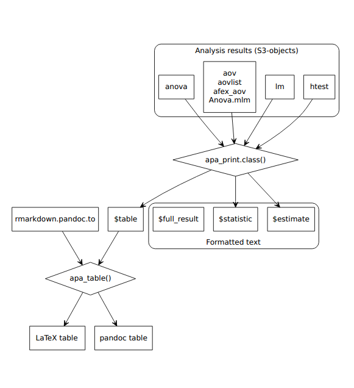
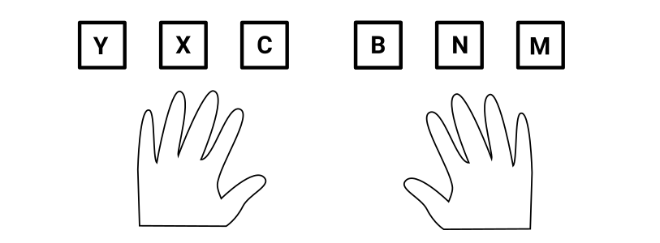
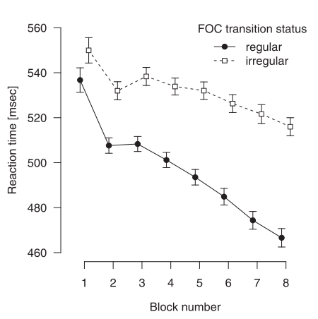

exclude: true

```{r child = "_setup.Rmd"}
```

```{r}
#| include: false

library("papaja")
library("ggplot2")
```


---
layout: true
template: footer

---

```{r out.extra = "style='float:right;'", out.width = "200px"}

```

# Scope of the package

**P**reparing **APA** **J**ournal **A**rticles

--

1. Designed for APA-style manuscripts
2. Templates for PDF and DOCX documents
--

3. Functions to facilitate reporting of results, e.g.
    - `apa_print()`, `apa_num()`
    - `apa_table()`
    - `apa_factorial_plot()`, `theme_apa()`

---
# Getting started

Install papaja from GitHub

```{r eval = FALSE, echo = TRUE}
# Install the stable development verions from GitHub
remotes::install_github("crsh/papaja", build_vignettes = TRUE)

# Install the latest development snapshot from GitHub
remotes::install_github("crsh/papaja@devel", build_vignettes = TRUE)
```

*Ensure the [required software](http://frederikaust.com/papaja_man/introduction.html#getting-started) is also installed*


---
layout: true
template: footer
name: templates

# Document templates

---
.center-70[]

<!-- TODO: Frederik -->


---
.center-70[`r include_graphics("img/papaja_skeleton.png")`]


---
layout: true
template: footer

---

| YAML field | Metadata |
|-----------|--------------------------------------|
| `author`  | list of author information (e.g., `name` and `affiliation`; start each new author with `-`) |
| `affiliation` | list of institutional information<br />(`id` and `institution`) |
| `authornote` | automatically contains corresponding author line |
| `keywords` | article keywords |
| `wordcount` | article word count |
| `note` | text to add above author note on the title page (e.g. "Preprint submitted for publication") |


---
### Rendering options

| YAML field | Effect |
|-----------|--------------------------------------|
| `bibliography` | List of bibliography files |
| `draft`<sup>\*</sup> | Add "DRAFT" watermark across all pages |
| `figurelist`<sup>\*</sup><br />`tablelist`<sup>\*</sup><br />`footnotelist`<sup>\*</sup> | Create lists of figure captions, table captions, or footnotes |

<small><sup>\*</sup> Only available for PDF documents</small>


---
### Rendering options

| YAML field | Effect |
|-----------|--------------------------------------|
| `floatsintext`<sup>\*</sup>  | Place figures and tables in the text rather than at the end |
| `linenumbers`<sup>\*</sup> | Add line numbers in margins |
| `mask` | Omit identifying information from title page |
| `classoption`<sup>\*</sup> | control the style of the document<br />(e.g., `man` or `doc`, see [`apa6`](https://mirror.hmc.edu/ctan/macros/latex/contrib/apa6/apa6.pdf) LaTeX class options) |

<small><sup>\*</sup> Only available for PDF documents</small>

<!-- - `floatsintext` ^*^: Place figures and tables in the text rather than at the end of the document -->
<!-- - `figurelist`, `tablelist`, `footnotelist`: Create lists of figure captions, table captions, or footnotes* -->
<!-- - `linenumbers`: Add line numbers in the margins* -->
<!-- - `mask`: Remove identifying information from the title page -->
<!-- - `draft`: Add "DRAFT" watermark across all pages* -->
<!-- - `classoptions` controls the style of the document* -->
<!--     - For example `man` or `doc` (see [`apa6`](https://mirror.hmc.edu/ctan/macros/latex/contrib/apa6/apa6.pdf) $\LaTeX$ class options) -->


???
<sup>*</sup> Only available for PDF documents


---
exclude: true
layout: false
template: templates

Use `papaja::apa6_pdf()` or `papaja::apa6_docx()` as output formats

- Extend `bookdown::pdf_document2()` and `bookdown::word_document2()`
    <!-- - Options for these functions should also work with `papaja` -->
- `papaja::apa6_docx()` is more limited
    <!-- - Rendering options with <sup>\*</sup> are only available for PDF -->
    - Some minimal manual tweaking of DOCX required for now (see [manual](https://crsh.github.io/papaja_man/limitations.html#microsoft-word-documents))


---
layout: true
template: footer
name: citations

# Citations

---
`citeproc` is a `pandoc` extension that formats references

- works well for both PDF and DOCX documents
- requires a separate reference file (e.g., CSL-JSON, Bib(La)TeX, EndNote) 

--

Add the following to the YAML front matter:

```{yaml, echo = TRUE}
bibliography: references.bib
```

In **papaja**, the default citation style is APA, 6th edition.


---
The reference handle is used to select citations

<small>

| Citation type | Syntax | Rendered citation |
|:--------------|:-------|:------------------|
| Citation within parentheses | `[@james_1890]` | (James, 1890) |
| Multiple citations | `[@james_1890; @bem_2011]` | (Bem, 2011; James, 1890) |
| In-text citations | `@james_1890` | James (1890) |
| Year only | `[-@bem_2011]` | (2011) |

</small>

???
Open and show BibTeX file


---
You can add pre- and post-fixes to individual citations

- `[e.g., @bem_2011]` yields "(e.g., Bem, 2011)"
- `[see @bem_2011 for a surprising result]` yields<br />"(see Bem, 2011, for a surpising result)"


---

Insert citations via

1. (Copy-and-paste)
2. Visual editor
3. RStudio addin [`citr`](https://github.com/crsh/citr)

--

Both connect directly to Zotero if the Zotero extension [Better Bib(La)TeX](https://github.com/retorquere/zotero-better-bibtex/wiki) is installed and Zotero is running

???
Demonstration!


---
layout: false
class: middle, center

# A quick demonstration!


---
layout: true
template: footer
name: citingr

# Citing R packages

---
_Reward volunteers who develop R packages for free!_ ;)

--

```{r cite, echo=TRUE}
citation("papaja")
```

---

- `r_refs()` creates a BibTeX file with references for all loaded packages (place at the end of document)
--

- `cite_r()` automates citing R and R packages

```{r eval = FALSE, echo = TRUE}
r_citations <- cite_r(file = "r-references.bib")
```

<div class="remark-code-line"><code class="r hljs remark-code">We used &#96;r r_citations&#96; for all analyses.</code></div>

> We used R (Version 4.1.3; R Core Team, 2022) and the R-package papaja (Version 0.1.0.9999; Aust & Barth, 2022) for all analyses.


---

Cite only selected packages or place package citations in a footnote

```{r echo = TRUE, eval = FALSE}
r_citations <- cite_r(
  file = "r-references.bib"
  , pkgs = c("afex", "emmeans", "papaja"), withhold = FALSE
  , footnote = TRUE
)
r_citations
```

```{r echo = FALSE, eval = TRUE}
r_citations <- cite_r(
  file = "../../exercises/3_papaja_example_manuscript/r-references.bib"
  , pkgs = c("afex", "emmeans", "papaja"), withhold = FALSE
  , footnote = TRUE
)
r_citations
```


---

Cite only selected packages or place package citations in a footnote

```{r echo = TRUE, eval = FALSE}
r_citations <- cite_r(
  file = "r-references.bib"
  , pkgs = c("afex", "emmeans", "papaja"), withhold = FALSE
  , footnote = TRUE
)
```

<div class="remark-code-line"><code class="r hljs remark-code">We used &#96;r r_citations$r&#96; for all analyses.<br /><br />

&#96;r r_citations$pkgs&#96;
</code></div>

???
If `withhold = TRUE`, `pkgs` is a blacklist, otherwise it is a whitelist

Demonstrate what this would look like in a document


---
layout: true
template: footer
name: results

# Report statistical analyses

---
Numerical values reported inline will be rounded

<div class="remark-code-line"><code class="r hljs remark-code">Participants mean age was &#96;r age_mean&#96; years (*SD* = &#96;r age_sd&#96;).</code></div>

> Participants mean age was 32.35 years<br />(*SD* = 6.23).

--
exclude: true

For more typesetting control use
- `apa_num()`, `apa_p()`, `apa_df()`
- `apa_interval()`, `apa_confint()`


---
Typeset numerical values for greater control

```{r echo = TRUE}
apa_num(c(143234.34557, Inf))
```

--

```{r echo = TRUE}
apa_num(42L, numerals = FALSE, capitalize = TRUE)
```

--

```{r echo = TRUE}
apa_num(1.7e10, format = "e")
```

---

Special-purpose wrappers for convenience

```{r echo = TRUE}
apa_p(c(1, 0.0008, 0))
```

--

```{r echo = TRUE}
apa_df(c(1, 15.93))
```

--

```{r echo = TRUE}
apa_confint(c(0.01, 0.8), conf.int = 0.95)
```


???
Demonstrate some of the options


---

```{r echo = TRUE}
# Data from Field, Miles, & Field (2012)
load("cosmetic_surgery.Rdata")

(cor_res <- with(cosmetic_surgery, cor.test(Post_QoL, BDI)))
```


---
`apa_print()` facilitates reporting of results. It returns a `list` with the following elements:

- `estimate`: Effect size estimate
- `statistic`: Hypothesis test statistic
- `full_result`: Combined estimates and statistics
- `table`


---

```{r echo = TRUE}
cor_apa_res <- apa_print(cor_res)
cor_apa_res[c("estimate", "statistic", "full_result")]
```

---

```{r echo = TRUE}
cor_apa_res$table
```

---
`apa_print()` adjusts behavior according to input

```{r echo = TRUE}
class(cor_res) # Result from cor.test()
```

```{r eval = FALSE, echo = TRUE}
?apa_print.htest
```

--

`methods(apa_print)` provides a list of supported classes


---

<small>

```{r echo = FALSE, results = "asis"}
print_classes <- gsub("apa_print\\.", "", as.character(utils::methods("apa_print")))
print_classes <- print_classes[!grepl(",", print_classes)]
print_classes <- c(print_classes, rep(NA,  (4 - length(print_classes) %% 4) * (length(print_classes) %% 4 > 0)))
print_classes <- matrix(print_classes, ncol = 4)
colnames(print_classes) <- apply(print_classes, 2, function(x) {
  first_letters <- tolower(substr(x, 1, 1))
  first_letters <- c(first_letters[1], tail(first_letters, 1))
  first_letters[is.na(first_letters)] <- "z"
  col_names <- if(first_letters[1] == first_letters[2]) first_letters[1] else paste(first_letters, collapse = "-")
  toupper(col_names)
})
print_classes[is.na(print_classes)] <- ""
knitr::kable(print_classes, format = "html", escape = FALSE)
```

See `vignette("extending_apa_print", package = "papaja")`.

</small>


---

```{r echo = TRUE}
lm_res <- lm(Post_QoL ~ Base_QoL + BDI, data = cosmetic_surgery)

lm_res_apa <- apa_print(lm_res, observed = TRUE)
str(lm_res_apa, max.level = 2)
```

---

```{r echo = TRUE}
lm_res_apa$estimate$Intercept
```

> `r gsub("\\\\", "\\", lm_res_apa$estimate$Intercept)`

--

```{r echo = TRUE}
lm_res_apa$full_result$modelfit$r2
```

> `r gsub("\\\\", "\\", lm_res_apa$full_result$modelfit$r2)`

???
Show how to look up method arguments


---
layout: true
template: footer
name: tables

# Rendering Tables


---
Tables returned by `apa_print()` have variable labels

```{r echo = TRUE}
lm_res_apa$table
```


---
Tables returned by `apa_print()` have variable labels

```{r echo = TRUE}
variable_labels(lm_res_apa$table)
```

---
`apa_table()` renders tables with variable labels

```{r echo = TRUE, eval = FALSE}
apa_table(
  lm_res_apa$table
  , caption = "Cosmetic surgery regression table."
)
```

<center><span style="font-size:75%;">Table 1. *Cosmetic surgery regression table.*</span><center>

<small>

| $\mathrm{Predictor}$ | $b$ | $\mathrm{95\% CI}$ | $t$ | df         | $p$ |
|:--------------|-------:|:-------------------:|-------:|-----------:|----:|
| Intercept     | 18.50  |  $[13.10$, $23.91]$ | 6.74   | 273 | &lt; .001  |
| Base QoL      | 0.59   |  $[0.50$, $0.67]$   | 13.23  | 273 | &lt; .001  |
| BDI           | 0.17   |  $[0.11$, $0.22]$   | 6.08   | 273 | &lt; .001  |

</small>


---
`apa_table()`

- was designed with table examples from the APA manual in mind
- is much more powerful in PDF documents

???
Point out what's not possible in Word

`kableExtra` is another powerful alternative


---
layout: false
class: middle, center

# A quick demonstration!

[GitHub folder](https://github.com/crsh/reproducible-research-practices-workshop/tree/main/exercises/3_papaja_table_example/)


---
template: results

```{r out.extra = 'id="zoom-margin"', out.width = "50%"}

```


---
layout: true
template: footer

# Creating figures

---
`apa_barplot()`, `apa_beeplot()`, `apa_lineplot()` can be used to visualize factorial designs


```{r barplot, eval = FALSE, echo = TRUE}
apa_barplot(
  id = "ID"
  , dv = "Post_QoL"
  , factors = c("Reason", "Surgery", "Gender")
  , data = cosmetic_surgery
  , ylab = "Quality of life post surgery"
  , las = 1
)
```


---

```{r echo = FALSE, eval = TRUE, fig.height = 5, fig.width = 9, ref.label = "barplot"}
```


???
Discuss some of the arguments


---
`apa_barplot()`, `apa_beeplot()`, `apa_lineplot()` can be used to visualize factorial designs

```{r beeplot, eval = FALSE, echo = TRUE}
# This time with bees
apa_beeplot(  #<<
  id = "ID"
  , dv = "Post_QoL"
  , factors = c("Reason", "Surgery", "Gender")
  , data = cosmetic_surgery
  , ylab = "Quality of life post surgery"
  , las = 1
  , args_legend = list(x = 0.25, y = 30)  #<<
  , args_points = list(bg = c("skyblue2", "indianred1"))  #<<
  , args_error_bars = list(length = 0.03)  #<<
)
```


---

```{r echo = FALSE, eval = TRUE, fig.height = 5, fig.width = 9}
# This time with bees
apa_beeplot(
  id = "ID"
  , dv = "Post_QoL"
  , factors = c("Reason", "Surgery", "Gender")
  , data = cosmetic_surgery
  , ylab = "Quality of life post surgery"
  , las = 1
 , args_legend = list(x = 0.25, y = 30)
 , args_points = list(bg = c("skyblue2", "indianred1"))
 , args_error_bars = list(length = 0.03)
)
```


---
All plot functions render variable labels, with some LaTeX math support (see `?latex2exp::TeX`)

```{r labelled-beeplot, eval = FALSE, echo = TRUE}
variable_labels(cosmetic_surgery) <- c(  #<<
  Post_QoL = "Quality of life post surgery ($\\bar{y}_{post}$)"  #<<
)  #<<

apa_beeplot(
  id = "ID"
  , dv = "Post_QoL"
  , factors = c("Reason", "Surgery", "Gender")
  , data = cosmetic_surgery
  , las = 1
  , args_legend = list(x = 0.25, y = 30)
  , args_points = list(bg = c("skyblue2", "indianred1"))
  , args_error_bars = list(length = 0.03)
)
```


---

```{r ref.label = "labelled-beeplot", eval = TRUE, echo = FALSE, fig.height = 5, fig.width = 9}
```


---
For `ggplot2` users, `papaja` provides `theme_apa()`

```{r ggplot, echo = TRUE, eval = FALSE}
ggplot(
    cosmetic_surgery
    , aes(x = Base_QoL, y = Post_QoL, color = Reason)
  ) +
  geom_point() +
  geom_smooth(method = "lm") +
  labs(
    x = "Baseline quality of life"
    , y = "Quality of life post surgery"
  ) +
  scale_color_brewer(palette = "Set1") +
  theme_apa(box = TRUE) +  #<<
  theme(legend.position = c(0.2, 0.8))
```


---

```{r ref.label = "ggplot", eval = TRUE, echo = FALSE, message = FALSE, fig.height = 5, fig.width = 7}
```

---
layout: true
template: footer

# Figure and table captions

---

Add a figure caption with the chunk option `fig.cap`

- Caption is reused for every figure in a chunk
  - Only one figure per chunk
  - Combine plots into multi-panel figures (e.g., `layout()`, `cowplot::plot_grid()`, or the **patchwork** package)

---

It's recommended to use "text-references"

<code class = "markdown hljs remark-code" style = "background: #F2F2F2;">(ref:volcano) This is a caption written as text reference.<br /><br />
&#96;&#96;&#96;{r fig.cap = "(ref:volcano)"}<br />
image(volcano)<br />
&#96;&#96;&#96;<br /><br />
&#96;&#96;&#96;{r}<br />
apa_table(volcano, caption = "(ref:volcano)")<br />
&#96;&#96;&#96;</code>

???
- Allow for LaTeX syntax and inline R code chunks
- Enable citations in captions and spell checking
- Text-references can be utilized anywhere


---
layout: true
template: footer

---

# Cross-referencing

To cross-reference figures and tables use<br />`\@ref(fig:chunk-label)` or<br />`\@ref(tab:chunk-label)`

- Chunk labels must not contain `_`
- Precede by non-breaking spaces, e.g.<br />`Figure\ \@ref(fig:chunk-label)`

---

# If you are stuck

1. Try our [work-in-progress manual](http://frederikaust.com/papaja_man/)
2. Ask on StackOverflow using the [`papaja`-tag](https://stackoverflow.com/questions/tagged/papaja)
3. Open a [GitHub issue](https://github.com/crsh/papaja/issues)


---
layout: false
class: middle, center

# Example manuscript

[GitHub folder](https://github.com/crsh/reproducible-research-practices-workshop/tree/main/exercises/3_papaja_example_manuscript)

---
layout: true
template: footer

# Serial response time task

---

```{r}

```

--

```{r}

```


???
If you like, use your own data.


---

```{r out.width = "50%"}

```


???
By comparing reaction times for regular transitions with random transitions,
is is possible to distinguish sequence-specific learning from general practice effects

increasing RT differences between regular and irregular transitions is a measure of sequence-specific learning


---
layout: true
template: footer

---
# Process Dissociation

Distinguish implicit and explicit learning

- Implicit: automatic, not controllable
- Explicit: controllable, may be used intentionally

<br />

.pull-left-40[
**Inclusion**<br>
"Generate a sequence that is as *similar* as possible"
]

.pull-right-40[
**Exclusion**<br>
"Generate a sequence that is as *dissimilar* as possible"
]


???

Implicit and explicit sequence knowledge are dissociated by their controllability

It is assumed that implicit knowledge is automatic and not controllable,
while explicit knowledge is controllable and may be used intentionally.

Participants work on two versions of a generation task: inclusion and exclusion


---
# The present study

Do variants of the PD task differ with respect to "baseline" performance?

- Generation task (**free** vs. **cued** generation tasks)
- Types of "random" material (**permuted** vs. **random** material)
- Performance without prior task exposure (**no-learning** group)

.grey[<small>(Stahl, Barth, & Haider, 2015)</small>]


---
# The present study

The following files are provided:

- The paper `manuscript.pdf` and `manuscript.docx`
- Bibliography file `references.bib`
- Data in the folder `data`
- Analysis script `analyses.R`

.center[https://tinyurl.com/rrpp-papaja]


---
layout: false
class: middle, center

# Exercise time

.center[[Exercise](http://frederikaust.com/reproducible-research-practices-workshop/exercises/3_papaja_question.html)]

.center[[Solutions](http://frederikaust.com/reproducible-research-practices-workshop/exercises/3_papaja_solution.html)]
