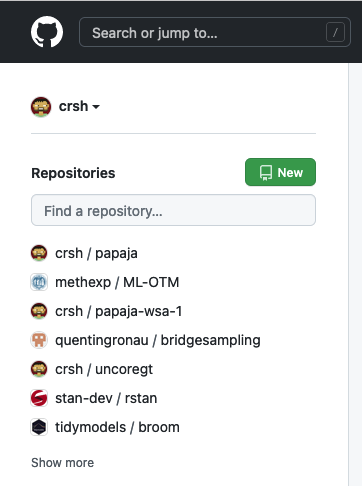
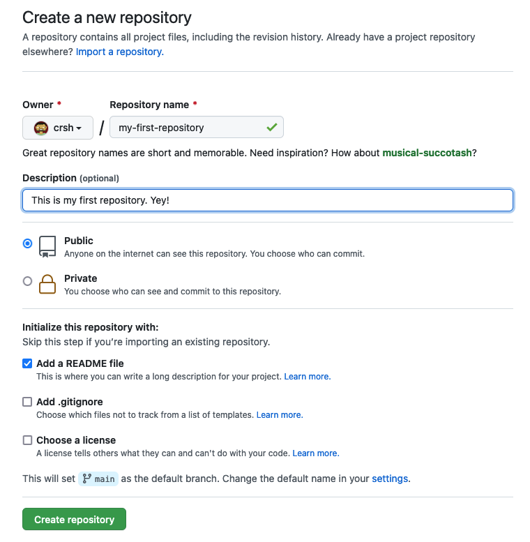
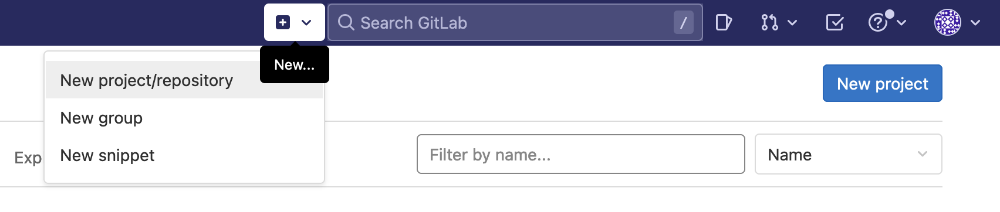
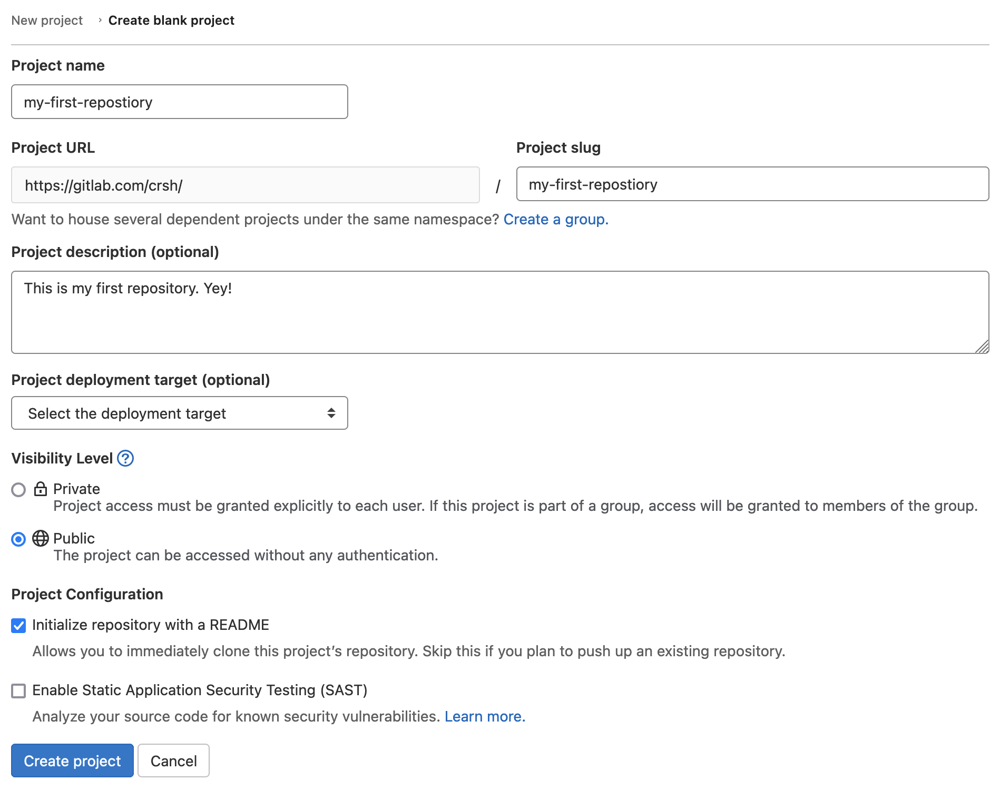
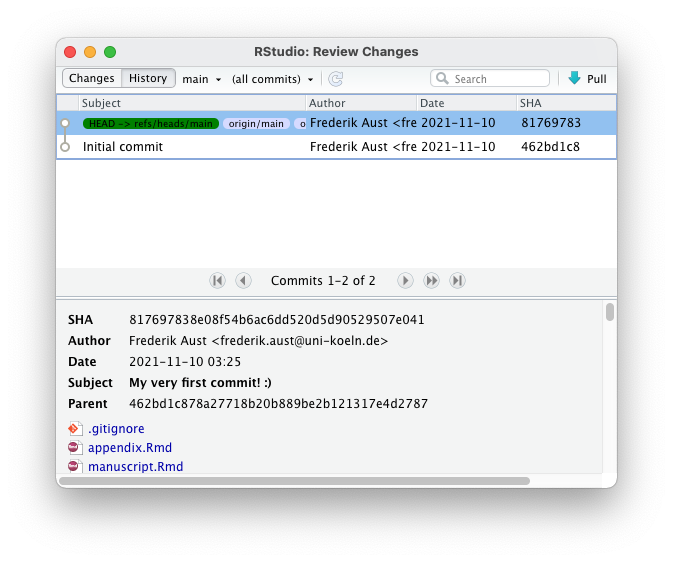

exclude: true

```{r child = "_setup.Rmd"}

```

---
layout: true
name: git

#  Git

---
name: vc

Command line tool

1. Version control
    - Track changes to *text files*
    - Retain version history of snapshot (*commits*)
    - Track provenance (who, what, when)

---

```{r out.width = "85%", out.extra='id="zoom-margin"'}

```

---
template: vc

2. Branching
    - Alternative versions of files
    - Simultaneous asynchronous collaboration

--
(Vuorre & Curley, 2018)


---

```{r}
include_graphics("img/git-branching.jpg")
```


---

Why use Git?

- Avoid mistakes, e.g.
    - Working on wrong version
    - Inadvertently deleting or editing files
--
- Track and merge changes of multiple collaborators across multiple files

--
- (Offsite backups)


---
layout: false
name: git-system

# Git

```{r out.height="", out.width="550px", echo = FALSE}
knitr::include_graphics("img/git-system.png")
```


---

```{r out.extra = "style='float:right;'", out.width = "150px"}
include_graphics("img/github-logo.png")
```

# GitHub

- Proprietary plattform
    - Free to use for academics
- Host remote Git repositories
--

- Provides slick web interface
- Offers project management tools
--

- Repositories can receive a DOI with [Zenodo](https://guides.github.com/activities/citable-code/)
--

- Servers located in the USA (GDPR)


---

# GitHub

<!-- TODO: Add screenshots to overlays -->

```{r out.height="450px", out.width="", echo = FALSE}

```


---
layout:false

```{r out.height="600px", out.width="", echo = FALSE}

```


---

```{r out.extra = "style='float:right;'", out.width = "150px"}
include_graphics("img/gitlab-logo.png")
```

# GitLab

- .highlight[Open source plattform]
  - .highlight[Can be hosted by your institution]
--

- Host remote Git repositories
- Provides slick web interface
- Offers project management tools
--

- .highlight[Servers can be located in your country] (GDPR)

---

# GitLab

<!-- TODO: Add screenshots to overlays -->

```{r echo = FALSE}

```


---
layout: false

```{r out.height="600px", out.width="", echo = FALSE}

```


---
layout: true
template: git

---

Clone your GitHub repository to your computer

~~~bash
git clone git@github.com:crsh/my-first-repository.git`
~~~

.pull-left-45[

```{r out.height="", out.width="450px", echo = FALSE}

```

]

.pull-right-45[

```{r out.height="", out.width="450px", echo = FALSE}

```

]


---

.pull-left-50[

`.gitignore`

- Files to ignore (do not track)
- Each line specifies a [pattern](https://git-scm.com/docs/gitignore)
- I typically add R Markdown cache files<br />(e.g., `.rdb`, `.rdx`)
    - `usethis:::git_ignore_lines`

]

.pull-right-40[


]


---
**Adding files**

~~~bash
git add . # Stage all changes
git commit -m "My very first commit! :)"
~~~

.pull-left-45[

- New files are "untracked", not watched for changes
- To start tracking "stage" and "commit" files

]

.pull-right-55[

```{r out.height="", out.width="85%", echo = FALSE}

```

]

???
Ammend a previous commit if you forgot to add a change

---
template: git-system


---

Now we can push changes to our remote repository

~~~bash
git push
~~~

```{r out.height="", out.width="700px", echo = FALSE}

```

--

~~~bash
git pull
~~~


---

~~~bash
git log
~~~

```{r out.height="450px", out.width="", echo = FALSE}

```


---
**Standard Git workflow**


~~~bash
git pull
git add .
git commit -m "Such exciting changes! :)"
git log
git push
~~~
