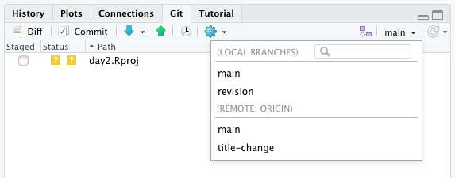

exclude: true

```{r child = "_setup.Rmd"}

```


---
layout: false
name: git-system

# Git

```{r out.height="", out.width="550px", echo = FALSE}

```

---
layout: true
name: collabo

# Collaboration

---

**Add collaborators**

.center[
`Settings > Manage access > Add people`
]

```{r out.height="", out.width="700px", echo = FALSE}

```

---

**Add collaborators**

.center[
`Project information > Members > Invite members`
]

```{r out.height="", out.width="600px", echo = FALSE}

```

---

GitHub provides a lot of collaboration features

- Edit files in browser
- Change highlighting and commenting
- Interactive revise-and-resubmit workflow
    - [See example](https://github.com/crsh/papaja/pull/443)
- Issue tracker (to-do list and discussion)
- ...


???
- Rich change view
- Comments on commits
- GitHub workflow is used by JOSS

Show git blame ;)

---

Workflows for collaboration

1. "Publishing" changes without prior review
    - Push directly to `main` branch on GitHub
--
2. Suggest changes with review (*pull request*)
    - Create a new *branch* ("parallel universe" of repository)
--

Edit on GitHub or in RStudio on your computer

---
layout: false

# Pull requests

```{r out.height="", out.width="500px", echo = FALSE}

```

1. Pull current state of repository
2. Create new _branch_ ("parallel universe")
3. Make changes, stage, commit, & push
4. Discuss and revise changes
5. Merge changes


---
layout: true

# Editing on GitHub

---

Small changes (to one file) in the browser on GitHub

```{r out.height="", out.width="700px", echo = FALSE}

```

---

```{r out.height="", out.width="700px", echo = FALSE}

```


---

```{r out.height="", out.width="700px", echo = FALSE}

```


???
- Request reviewer


---
name: review

Reviewers can provide

- comments on specific changes

---
template: review

```{r out.height="", out.width="700px", echo = FALSE}

```

---
template: review

- higher level comments on the entire pull request

```{r out.height="", out.width="650px", echo = FALSE}

```


???
Show how to make additional changes after review

https://github.com/crsh/my-first-repository/pull/1


---
layout: true
template: footer

# Editing on your computer 

---

Larger changes across multiple files in RStudio

1. Pull current state of remote repository
2. Switch to new _branch_ ("parallel universe")
3. Make changes, stage, commit, & push

.pull-left-45[

~~~bash
git pull
*git branch revision
*git checkout revision
git status
git add .
git commit -m "My changes"
...
*git push origin revision
~~~

]

.pull-right-45[

```{r out.height="", out.width="100%", echo = FALSE}

```

]

---

```{r out.height="", out.width="100%", echo = FALSE}

```


---

```{r out.height="", out.width="100%", echo = FALSE}

```

---
layout: true

# Merge conflicts `r ji("scream")`

---

Competing changes to *the same line of text*

```{r out.height="", out.width="100%", echo = FALSE}

```

---

Review competing changes marked by `<<<<<<<<` and `>>>>>>>>`

```{r out.height="", out.width="100%", echo = FALSE}

```

--

Again, this can be done on GitHub or in RStudio

---

Stage and commit conflict resolution

```{r out.height="", out.width="100%", echo = FALSE}

```

~~~bash
git add . 
git commit -m "Resolved merge conflict by doing something"

~~~

---
layout: false
class: middle, center

# Exercise time

.center[[Exercise](http://frederikaust.com/reproducible-research-practices-workshop/exercises/6_github_collaboration_question.html)]

.center[[Solutions](http://frederikaust.com/reproducible-research-practices-workshop/exercises/6_github_collaboration_solution.html)]
