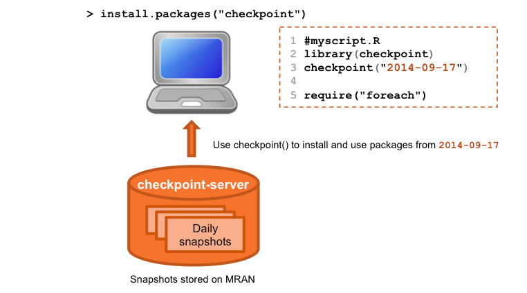
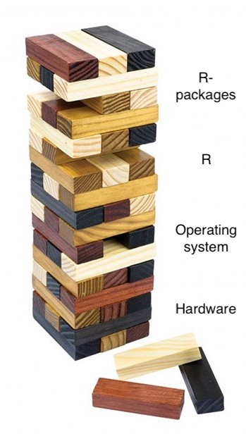
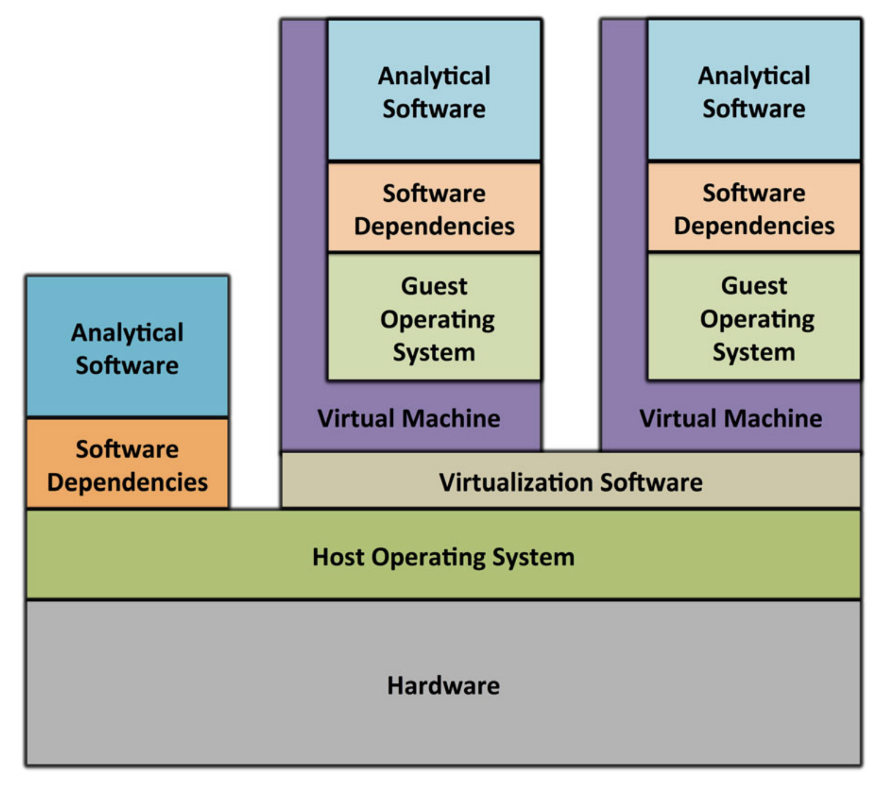
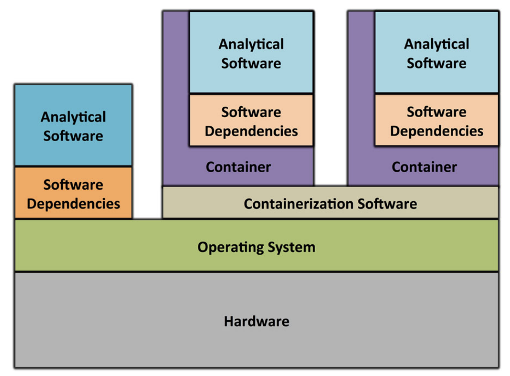
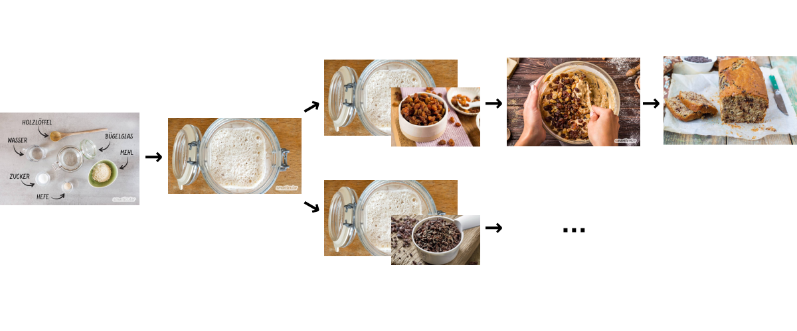
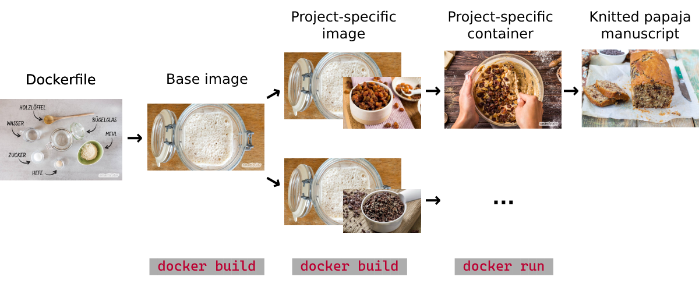
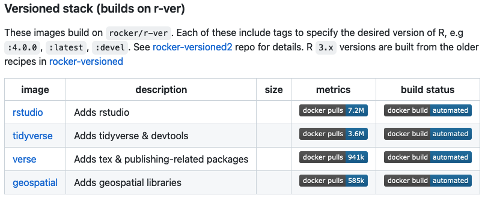
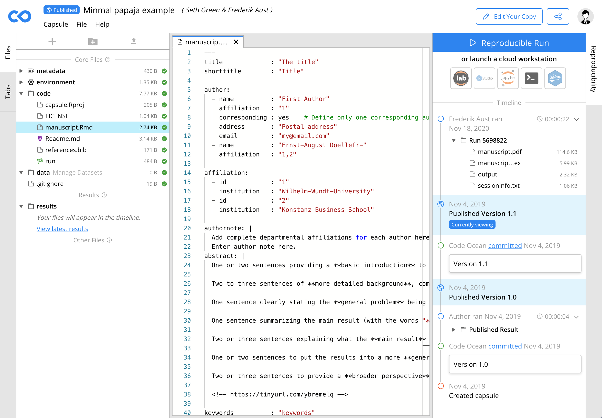
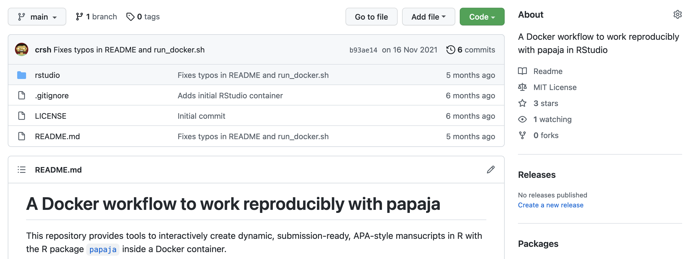

exclude: true

```{r child = "_setup.Rmd"}
```

---

# Other topics in reproducible research

.small[
As we said in the introduction, we cannot cover all tools and topics related to reproducible research in this workshop. However, we want to use this session to cover some additional tools as well as other topics in reproducible research:

- Collaborating with others who do not use `R Markdown` and/or `Git`
- R package dependency management
- Preventing code rot
- Publishing reproducible research environments and "one-click reproducibility"
]

---

# Other approaches to collaboration

There also are `R` packages that you can use for collaborating on `R Markdown` documents with people who do not (want to) use `R Markdown` (and `Git`):

- [`trackdown`](https://claudiozandonella.github.io/trackdown/) uses *Google Drive* for this

- [`redoc`](https://noamross.github.io/redoc/) "is a package to enable a two-way R Markdown-Microsoft Word workflow" (*note*: development currently suspended)

---

# `trackdown`

The basic workflow for `trackdown` is that you upload the content of an `.Rmd` file to *Google Drive* where you can collaboratively edit the text parts. You can then download the document again (e.g., to edit the code in the `R Markdown` document in *RStudio*), and also update the file on *Google Drive* after changing the `.Rmd` locally. The [`trackdown` documentation](https://claudiozandonella.github.io/trackdown/) provides further details.

---

# Advanced use of `trackdown` with `Git`

To combine `R Markdown` with collaborative text editing via `trackdown` and version control (and to avoid potential issues caused by - possibly unintended - changes to the code parts on *Google Drive*), the author of the `trackdown` package, [Claudio Zandonella Callegher](https://github.com/ClaudioZandonella), proposes a solution in an [issue in the *GitHub* repository for the package](https://github.com/ClaudioZandonella/trackdown/issues/31).

Essentially, the idea here is to create a `trackdown` branch in the `Git` repository and merge it with the `main` branch which is (mainly) used to edit the code.


<!-- Frederik takes over from here -->

---
layout: true
template: footer

# Dependency management


---

```{r zoomable-plot, out.width = "75%", out.extra='id="zoom-margin"'}
include_graphics("img/dependendy-graph.png")
```

---

- Our projects may use/require different package versions
- Manually managing dependencies is a nightmare
    - Keeping track of the dependencies and their changes
    - Restore the R environment

---

1. [`checkpoint`](https://github.com/RevolutionAnalytics/checkpoint/) by Microsoft
  - Requires a project-based workflow
  - Package database will gradually grow
--

2. [`groundhog`](https://groundhogr.com/)
  - Package database will gradually grow
--

3. [`renv`](https://rstudio.github.io/renv/articles/renv.html) by RStudio
  - Most flexible and powerful
  - Least straight forward to use
  - No "forensic" applications

---

```{r}

```


---

Dependencies are detected automatically

```{r echo = TRUE, eval = FALSE}
library("checkpoint")
checkpoint("2022-04-27")

library("ggplot2")
```

--

Uses a date-specific directory outside of usual library

```bash
~/.checkpoint/...
```

---
layout: true
template: footer

# Code rot

---
name: toppling

.pull-left-75[

```{r echo = FALSE, fig.align = "center", out.height = "475px", out.width = ""}

```

]

---
template: toppling

.pull-right-25[
<br /><br />
`r ji("white_check_mark")`
]


---
- We need to archive the computing environment

--
- But how?

--
    - Lock away computer used to run the analysis?
    - Trade-off between robustness and feasibility

--

<br />

```{r echo = TRUE, eval = FALSE}
checkpoint("2020-01-01", r_version = "3.6.2")
```

---
template: toppling

.pull-right-25[
<br /><br />
`r ji("white_check_mark")`
<br /><br />
(`r ji("white_check_mark")`)
]


---

### Virtual machines

```{r echo = FALSE, fig.align = "center", out.height = "", out.width = "450px"}

```

.center[
  <span style = "font-size: 75%">(Piccolo & Frampton, 2016)</span>
]


---

### Containers

```{r echo = FALSE, fig.align = "center", out.height = "", out.width = "450px"}

```

.center[
  <span style = "font-size: 75%">(Piccolo & Frampton, 2016)</span>
]


---
template: toppling

.pull-right-25[
<br /><br />
`r ji("white_check_mark")`
<br /><br />
`r ji("white_check_mark")`
<br /><br />
`r ji("white_check_mark")`
]


---
layout: false

# Docker

```{r echo = FALSE, fig.align = "center", out.height = "", out.width = "450px"}
knitr::include_graphics("img/docker-logo.png")
```


---
layout: true

# Docker: Kind of like Hermann

<small>
> Herman cake (often called Herman) is a 'friendship cake'. [...] the starter is passed from person to person (like a chain letter) and continues to grow as it contains yeast and lactic acid bacteria. One starter can, in theory, last indefinitely. ([Wikipedia](https://en.wikipedia.org/wiki/Herman_cake))
</small>

---

```{r echo = FALSE, fig.align = "center", out.height = "", out.width = "700px"}

```


---

```{r echo = FALSE, fig.align = "center", out.height = "", out.width = "700px"}

```


---
layout: true

# Docker

---

Built on a prepackaged base images from DockerHub (["rocker"](https://github.com/rocker-org/rocker#versioned-stack-builds-on-r-ver))

```{r echo = FALSE, fig.align = "center", out.height = "", out.width = "450px"}

```

---

**Simplified Docker example**

--

~~~Dockerfile
# Select base image
FROM rocker/rstudio:4.1.2
~~~

- Latest Debian version
- R 4.1.2
- Latest RStudio version
    - Pandoc
- Git


---

Add system-level requirements

~~~Dockerfile
# System libraries
RUN apt-get update \
  && apt-get install -y --no-install-recommends \
*  libgsl0-dev \
*  libnlopt-dev \
*  libxt6 \
*  ssh
~~~


---

Install TeX Live 2021 and required LaTeX packages

~~~Dockerfile
# TeX Live
ENV CTAN_REPO=http://mirror.ctan.org/systems/texlive/tlnet
RUN /rocker_scripts/install_texlive.sh
ENV PATH=$PATH:/usr/local/texlive/bin/x86_64-linux

RUN tlmgr install \
*  apa6 apa7 booktabs caption csquotes \
*  ...
~~~


---

Install `papaja` and required R packages

~~~Dockerfile
# Setup R packages for papaja
RUN install2.r --error \
--skipinstalled \
*  tinytex \
*  remotes \
*  markdown \
*  mime

## Latest papaja development version
RUN Rscript -e "remotes::install_github('crsh/papaja')"
~~~

---

Our image bundles (among other things)

- Latest Debian version
- R 4.1.2
- Latest RStudio version
    - Pandoc
- Git

--
- .highlight[TeX Live 2021]
- .highlight[Latest `papaja` version]


---
exclude: true

Online services (e.g. CodeOcean, Clyburne-Sherin, Fei, & Green, 2019)

```{r out.width = "600px"}

```

Limited computational resources


---

[A minimally obtrusive Docker workflow to work reproducibly with papaja](https://github.com/crsh/papaja_docker)

```{r out.width = "700px"}

```


---
layout: false
class: middle, center

# A quick demonstration!


---

<!-- Johannes takes over from here -->

# Publishing reproducible research environments

If you want to publicly share your fully reproducible research environment and allow others to interact with it without having to install any software on their own machines, you can use services like [*Code Ocean*](https://codeocean.com/) or [*RStudio Cloud*](https://rstudio.cloud/). A good free and open source alternative is [*BinderHub*](https://binderhub.readthedocs.io/en/latest/). 

---

# What is *BinderHub*?

From the [*BinderHub GitHub* repository](https://github.com/jupyterhub/binderhub):

*BinderHub* allows you to `BUILD` and `REGISTER` a `Docker` image from a `Git` repository, then `CONNECT` with *JupyterHub*, allowing you to create a public IP address that allows users to interact with the code and environment within a live *JupyterHub* instance. You can select a specific branch name, commit, or tag to serve.

---

# What is *BinderHub*?

From the [*BinderHub GitHub* repository](https://github.com/jupyterhub/binderhub):

*BinderHub* ties together:

- [*JupyterHub*](https://github.com/jupyterhub/jupyterhub) to provide a scalable system for authenticating users and spawning single user [`Jupyter Notebook`](https://jupyter.org/) servers, and
- [*Repo2Docker*](https://github.com/jupyter/repo2docker) which generates a `Docker` image using a `Git` repository hosted online.

---

# What is *BinderHub*?

```{r binger-img, out.width = "125%", echo=FALSE}

```

---

# How to use *BinderHub*

Using a *BinderHub* deployment like [*mybinder.org*](https://mybinder.org/) or [*GESIS Notebooks*](https://notebooks.gesis.org/binder/) you can turn an existing public `Git` repository into a publicly accessible executable environment.

In order for this to work, you just need to add a few *Binder*-specific files to your repo (i.e., "Binderize" it).

--

.small[
A platform that works in similar ways is [*PsychNotebook*](https://www.psychnotebook.org/)
by the [Leibniz Institute for Psychology (ZPID)](https://leibniz-psychology.org/en/).
]

---

# Binderizing your `Git` repository

The minimum requirements are the following:

1. Add a `binder` folder to your repo
2. In that folder, create two files: `runtime.txt` & `install.R`

.small[
*Note*: It would also be ok to add those files to the root folder of your project.
]

---

# Binderizing your `Git` repository

In the `runtime.txt` file, you need to specify a version number and date, indicating which [snapshot](https://packagemanager.rstudio.com/client/#/repos/1/overview) to use from the [*R Studio Package Manager*](https://packagemanager.rstudio.com/client/#/). Example: `r-4.1-2022-04-22`).

---

# Binderizing your `Git` repository

In the `install.R` file, you need to specify which `R` packages to install as you normally would in an `.R` file (e.g., `install.packages(c("gapminder", "tinytex"))`). *CRAN* packages are installed through the [*R Studio Package Manager*](https://packagemanager.rstudio.com/client/#/).

---

# Binderizing your `Git` repository

There are many more options for changing or extending the executable environment. Two good resources to learn more are the [*Turing Way* guide *Zero-to-Binder*](https://the-turing-way.netlify.app/communication/binder/zero-to-binder.html) or the [*Binder* example for `R`](https://github.com/binder-examples/r). 

---

# Deploying your executable environment

Once you have "Binderized" your repository, you can use [*mybinder.org*](https://mybinder.org/) to create the executable environment. You can set a few additional parameters in the process (such as the branch). *NB*: Creating the executable environment can take some time (esp. if you install many and/or large `R` packages).

--

.small[
*Note*: You can also use the [`holepunch` package](https://karthik.github.io/holepunch/) to Binderize your `R` project hosted on *GitHub*.
]

---

# Deploying your executable environment

Once the executable environment has been created, anyone who has the link to it can use it. The easiest way to share it and enable "1-click reproducibility" for others is by adding a *Launch Binder* button to the `README` for your associated *GitHub* (or *GitLab*) repository. The `Markdown` code for this will be displayed on the *mybinder* site.

---

# Things to note when using *Binder*

.smaller[
1. The *BinderHub* deployments are hosted on free-to-use servers (sometimes by academic institutions), so you might experience some "hiccups" in deploying and using the executable environments (e.g., if the service is heavily used at the time).
2. Related to that, the amount of RAM is limited for the executable environment.
3. One thing you need to consider is how to share your data when using *Binder*. The [*Turing Way* guide *Zero-to-Binder*](https://the-turing-way.netlify.app/communication/binder/zero-to-binder.html) has some suggestions for that.
4. By default, the link to the executable environment will open an instance of [*Jupyter Notebook*](https://jupyter.org/), but it is also possible to run [*Jupyter Lab*](https://jupyterlab.readthedocs.io/en/stable/#), or *RStudio* (this can be done by adding parameters at the end of the URL, such as `$urlpath=rstudio`). 
]

---

# Test drive `r ji("racing_car")`

We have prepared a Binderized repo for you that you can test, clone, fork or whatever else you would like to to: https://github.com/jobreu/binder-r-demo

---

# Exercise

Try out and explore one or more of the tools we have just presented:

- `trackdown`
- one of the `R` packages for dependency management (such as `renv`, `checkpoint`, or `groundhog`)
- `Docker`
- `Binder`

---

# Exercise

What did you do?

What were your experiences?

Do you think you are going to use the tool(s)? Why/why not? If yes, for what purposes?

---

# Project setup and templates

In this workshop, we have shown you how to manually set up a reproducible research workflows. However, there are some tools that you can use to automate parts of this process. These can range from very simple to very elaborate solutions. We will show you two examples in the following.

---

# Project setup and templates

`create-project.sh`: small shell script for initializing a basic project folder structure (which can be easily adapted and extended using any text editor)

To run the file, open a shell/command line interface (and navigate to) where the `create-project.sh` file is located. To execute it, you need to provide a valid path for the new project folder that should be created as an argument.

---

# Project setup and templates

```{r eval=FALSE, echo=TRUE}
sh create-project.sh "./my-project"
```

---

<!-- Frederik -->

# Project setup and templates

Frederik's `R` package for initializing new projects: https://github.com/crsh/template

---

<!-- Back to Johannes -->

# Workflow tools

There also several `R` other packages for facilitating the creation and maintenance of reproducible research workflows, such as...

- [`WORCS`](https://cjvanlissa.github.io/worcs/index.html) - *Workflow for Open Reproducible Code in Science*
- [`workflowr`](https://workflowr.github.io/workflowr/)
- [`starter`](https://www.danieldsjoberg.com/starter/)
- [`rrtools`](https://github.com/benmarwick/rrtools) - Tools for Writing Reproducible Research in R

[*start your lab*](https://www.startyourlab.com/) also provides an [`R` Project Template](https://github.com/startyourlab/r-project-template).

---

# Choosing the right tools `r ji("hammer")``r ji("wrench")`

There are a few things to consider for choosing the right tools:

- Your **habits, knowledge, and preferences** (as well as those of your collaborators)
- Your **goals** and their relative importance: E.g., computational reproducibility, reusability, replicability
- Your **audience**: Future you, collaborators, the academic community, the general public

---

# Shoulders of giants... but sometimes also clay feet

.small[
As you may have already experienced, not all tools always play together nicely. Keep in mind, that most tools that we have covered in this workshop are free and open source software (FOSS). Also, tool stacks can have break points and many tools themselves depend on other tools/tool stacks. Hence, things may not always work perfectly.

But don't despair! There usually are solutions ([*Stack Overflow*](https://stackoverflow.com/) and issues in associated *GitHub* repositories are good places to find them) and the advantage of FOSS is that there usually is an active development community that you can also get involved in.
]

---

# Showing appreciation `r ji("clapping_hands")`

The creation and maintenance of FOSS takes a lot of time and this is rarely recognized as much as it should be. One thing we can do to change this is to at least give credit where credit is due and cite the tools and resources that we use.

---

# Showing appreciation `r ji("clapping_hands")`

```{r cite, echo=TRUE}
citation("papaja")
```

---

# Showing appreciation `r ji("clapping_hands")`

When working with `R Markdown`, you can create a `packages.bib` file to cite the packages you have used, either manually, using `papaja::r_refs()`, or the [`grateful` package](https://pakillo.github.io/grateful/).

---

# Share the `r ji("heart")` for reproducible research tools

In addition to properly citing the tools and resources you use, you can make sure that they get the recognition they deserve by talking about them (e.g., on social media) and convincing your collaborators to use them as well.

---

# Looking back

You created a *GitHub*/*GitLab* repository containing materials for a fully reproducible research pipeline! `r ji("popper")`

If you created a public *GitHub* repository: Head over to http://starlogs.net/ and paste the URL of the repository to recap your heroic journey into the universe of reproducible research! `r ji("milky_way")`

---

# Looking forward

We hope that we could get you started or help you with with making your research (more) reproducible. 
Of course, as always, there is much more to explore and learn. The only way to really get familiar with the tools and workflows is if you use them for your own research.

--

Keep calm and stay reproducible! `r ji("smiling_face_with_smiling_eyes")`

---

class: center, middle

# Thank you very much for participating in this workshop! `r ji("bowing_man")`

We hope that you learned something and also had some fun (at least a little bit...)
